# Step by Step

## ⬇️ — Step 1: Download DSK

Visit our downloads page [github.com/atelierdisko/dsk/releases](https://github.com/atelierdisko/dsk/releases) and find the green label “latest release”. Next to it you will see a bunch of download links. If you are using a Mac, click on “dsk-darwin-amd64.zip”. For Linux, click on “dsk-linux-amd64.tar.gz”. This will start the download of the DSK quickstart package for your operating system.

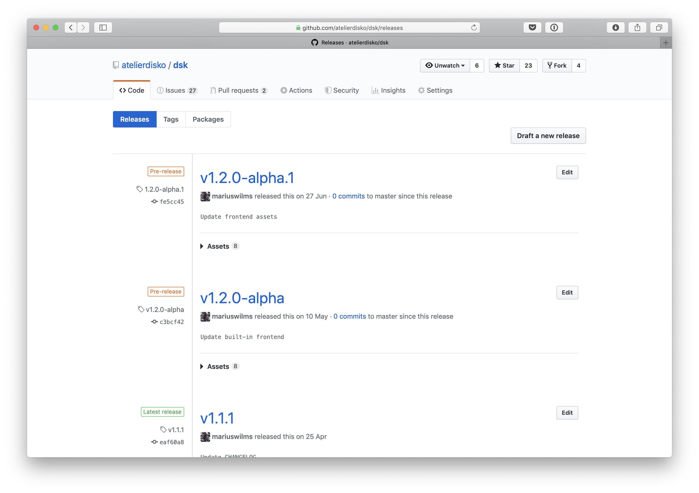

For the remainder of the tutorial we will assume that you are using macOS, but the steps on Linux are virtually the same.

## 🔮 — Step 2: Set up DSK
First, we want to set up a folder that you can document you Design System in. Create a new folder on your Desktop, called “my-design-system”.

Next, find the package that you just downloaded and double click it to unzip the files. You will now see a folder that contains some other folders and files. Take the content of the unzipped folder and copy it over into your “my-design-system” folder.

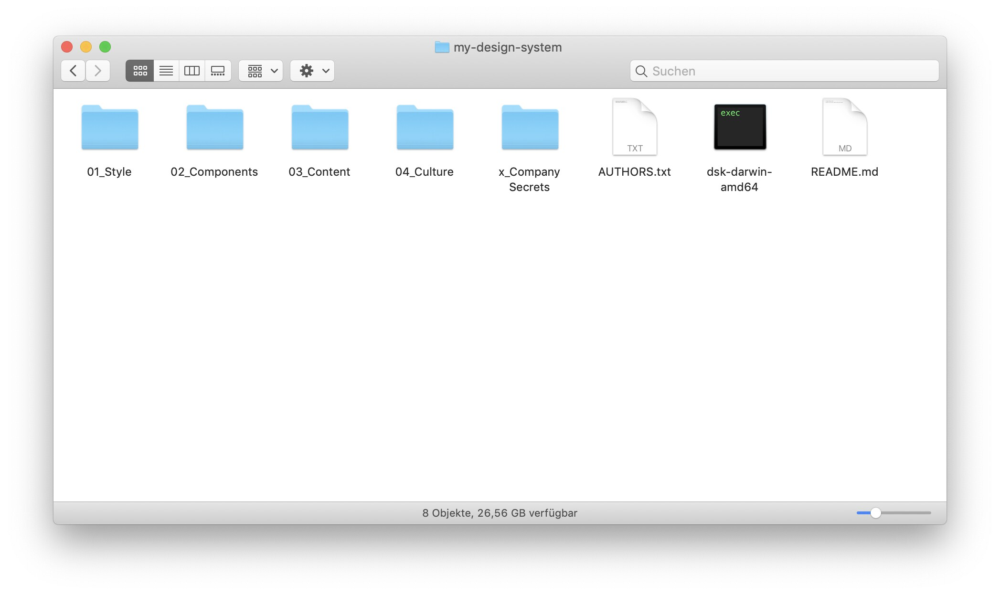

## 🌲 — Step 3: Set up the design definitions tree
The folder “my-design-system” is the root of your “[design definitions tree](/The-Design-Definitions-Tree)”. It will contain the entire documentation of your Design System.

You can now take a look at the example Design System from the package if you like – these are the folders you just copied over, like “Styleguide” and ”Components”. For this tutorial we want to start from scratch, so please delete everything in “my-design-system”, except for the file that is called “dsk-darwin-amd64”.

## 🏃‍♀️ — Step 4: Run DSK

“my-design-system” now only contains a black exec-file called “dsk-darwin-amd64”. This is the DSK application that you want to use. Double click on the file to start DSK.

The first time you do this, a warning may pop up. To skip it, follow [these instructions](https://support.apple.com/kb/PH25088).

A black Terminal window will open. Don’t worry, you won’t have to do anything in the command line, just keep the window open in the background. DSK is running until you close this window.

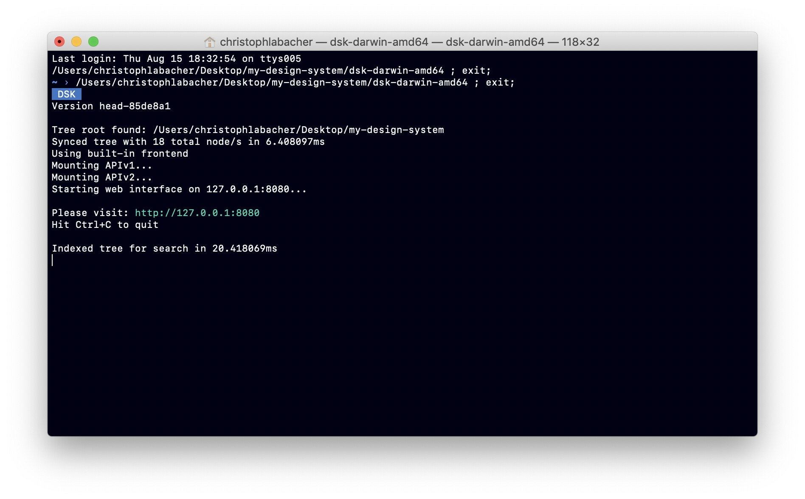

## 🌍 — Step 5: Open DSK in the browser  
Open your favorite browser and navigate to `http://localhost:8080` (you can just click [here](http://localhost:8080) to get there!). You can see your Design System at this address, as long as DSK is running on your computer.

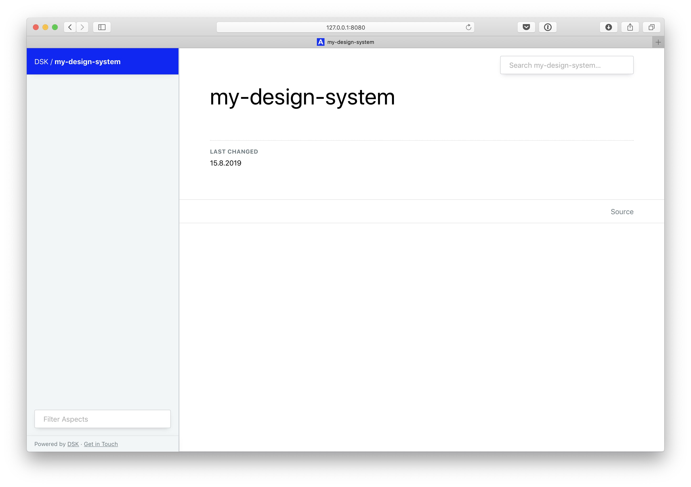

The site looks pretty empty right now – that’s because there is nothing to display in your design definitions tree yet. Let’s change that!

## 📁 — Step 6: Create your first aspect  
Create two new folders in the “my-design-system” folder and call them “Styles” and “Components” (or any other name you like – with DSK the structure and content of you documentation is entirely up to you). If you now open your browser and refresh the page you will see your first [aspects](/The-Design-Definitions-Tree/Aspects) in the tree navigation on the left side!

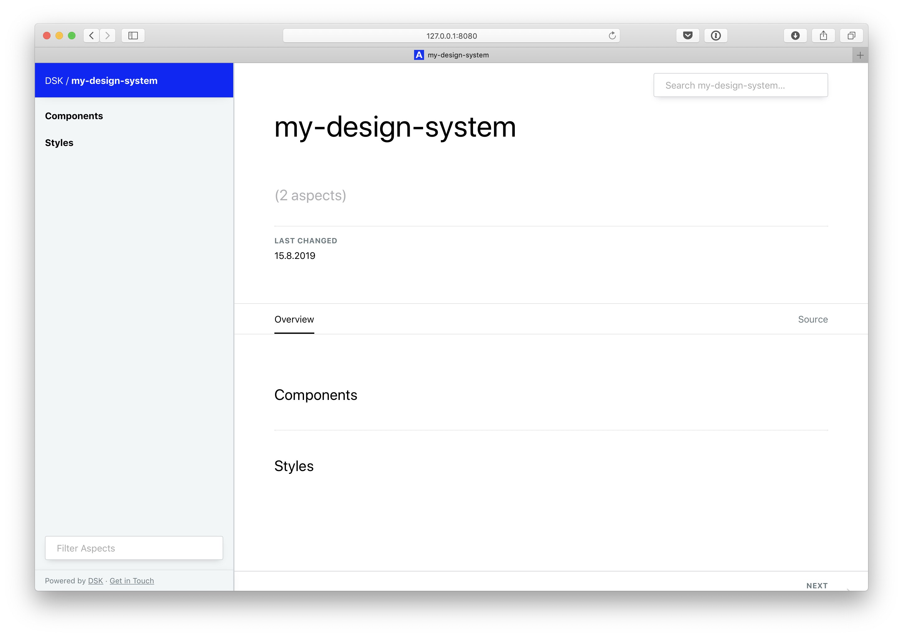

## 🗒 — Step 7: Add documentation  
Your aspects are still empty, so let’s add some documentation!

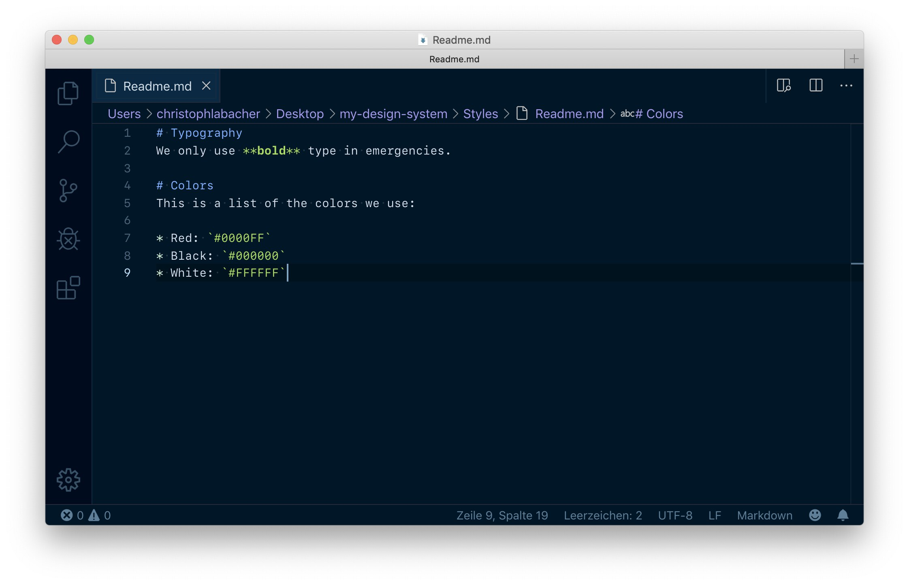

For documentation we use a special format, which is called “Markdown”. Every Markdown file has to end with `.md`. In Markdown you write text as usual, but you can use special symbols in your text. For example, a line that starts with `#` is treated as a headline, and words that are surrounded by two asterisks (`*`) are shown in bold (`you use it **like this**`). This way, you can style your document, without having to use a programming language. You can find a list of which symbols you can use to format your text [here](https://guides.github.com/features/mastering-markdown/). On [www.markdownguide.org/getting-started](https://www.markdownguide.org/getting-started/) you can read more about Markdown in general.

This is an example of what a document might look like:

```markdown
# Typography
We only use **bold** type in emergencies.

# Colors
This is a list of the colors we use:

* Red: `#0000FF`
* Black: `#000000`
* White: `#FFFFFF`
```

You can create a Markdown file like this: Go to your programs folder and search for “TextEdit”. Click the “Format” menu and select “Make Plain Text”.  Save the file and give it a name ending with `.md`, e.g. “documentation.md”. Place it in the “Styles” folder that you created. Voilà, you created your first [document](/The-Design-Definitions-Tree/Documents)!

Open your browser and refresh the page – you will see the content of your document. If you add more than one Markdown file in the same folder, they will be displayed as tabs on the page.

## 🗄 — Step 8: Add more aspects
You can add as many aspects as you like and even nest them. Open the “Components” folder and create a few new folders, like “01-Text Field” and “02-Button” in it. The numbers in the front tell DSK in what order to display the aspects, but they get removed from the title that is displayed in the browser.

## 🌁 — Step 9: Add assets 

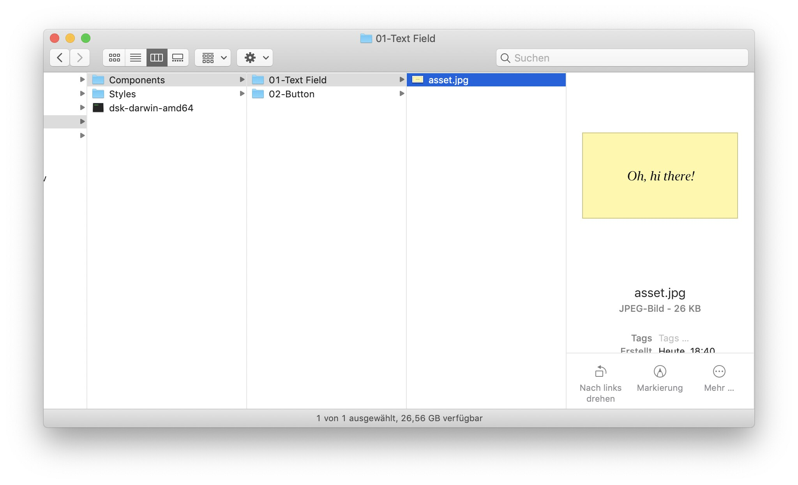

You can add files of any type to DSK. If you want to add a quick drawing or a Sketch file or even a video of a prototype to one of your aspects, place any file you like into the "01-Text Field" folder and refresh your browser. You will see an “Assets” tab that displays the file and some information about it. You can also download the file there. Any file that is not directly used by DSK is called an [asset](/The-Design-Definitions-Tree/Assets).

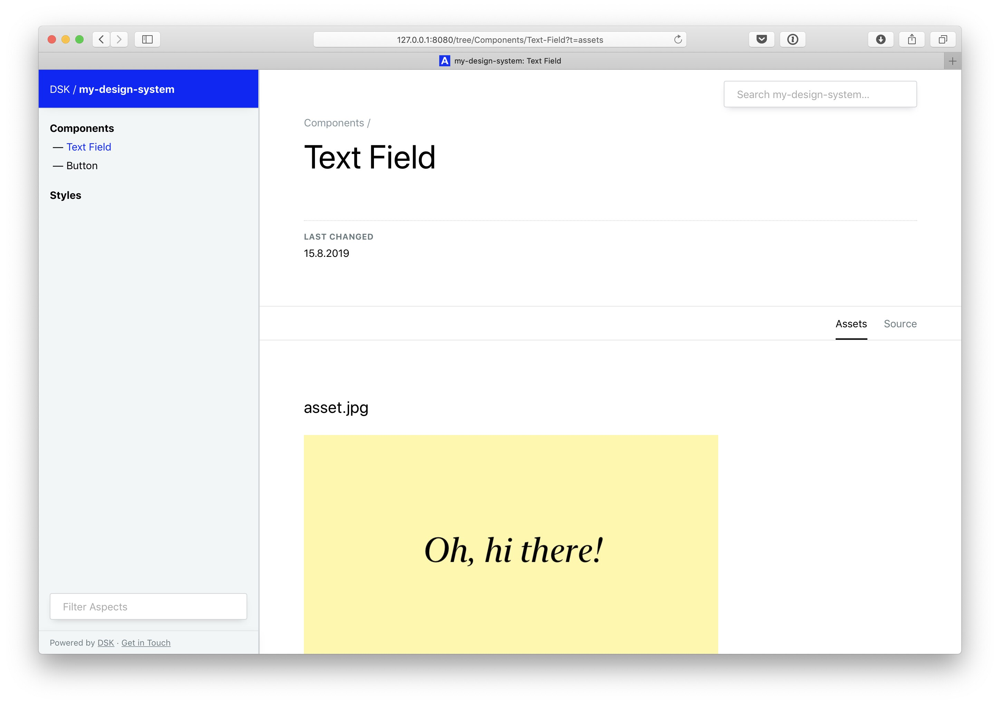

## 🏷 — Step 10: Add meta data

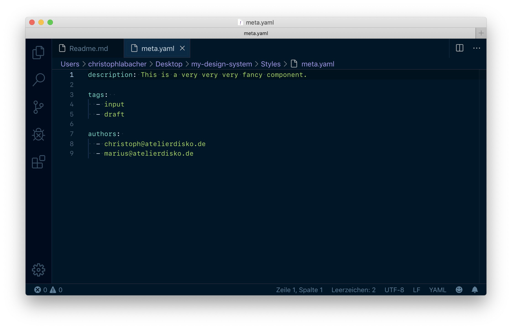

Additionally to documenting your design aspects, you can also add some meta data about them. This makes it easier to organize your Design System and improves search results.

Meta information are saved as “YAML”-files, which are easily readable and understandable. This video gives a great introduction into how to write a YAML: [YAML: syntax basics - YouTube](https://www.youtube.com/watch?v=W3tQPk8DNbk).

You can copy this example configuration and adapt it if you want to:

```yaml
description: This is a very very very fancy component.

tags:  
  - input
  - draft

authors: 
  - christoph@atelierdisko.de
  - marius@atelierdisko.de
```

You can create a YAML file like this: Go to your programs folder and search for “TextEdit”. Click the “Format” menu and select “Make Plain Text”.  Save the file and give it the name “meta.yaml”. Place it in the “01-Text Field” folder.

For DSK to find and understand the meta data, it is important that the file is called “meta.yaml” – you shouldn’t change the name.

Even without knowing YAML, you can already see that this file contains a description of the aspects, tags and authors. The description is a short text that will be display on the top of the aspect’s page. Tags let you filter your components and make it easier to group aspects together. Authors let you assign responsibility for an aspect and help users quickly find someone to talk to when they have questions.

These are just the most commonly used types of meta data that you can add. You can find more types and how to add custom types in the in depth [meta data documentation](/The-Design-Definitions-Tree/Meta-Data).


## 🖋 — Step 11: Add information about the authors  
When we just added the meta data to the aspect, we used an email address to describe the authors. But sometimes it is nicer to display a persons full name. DSK lets you create a special file, where you can compile a list of all people and their email addresses. Whenever you use someone’s email address in a meta data file, DSK will look up their full name and display it alongside their address in the browser.

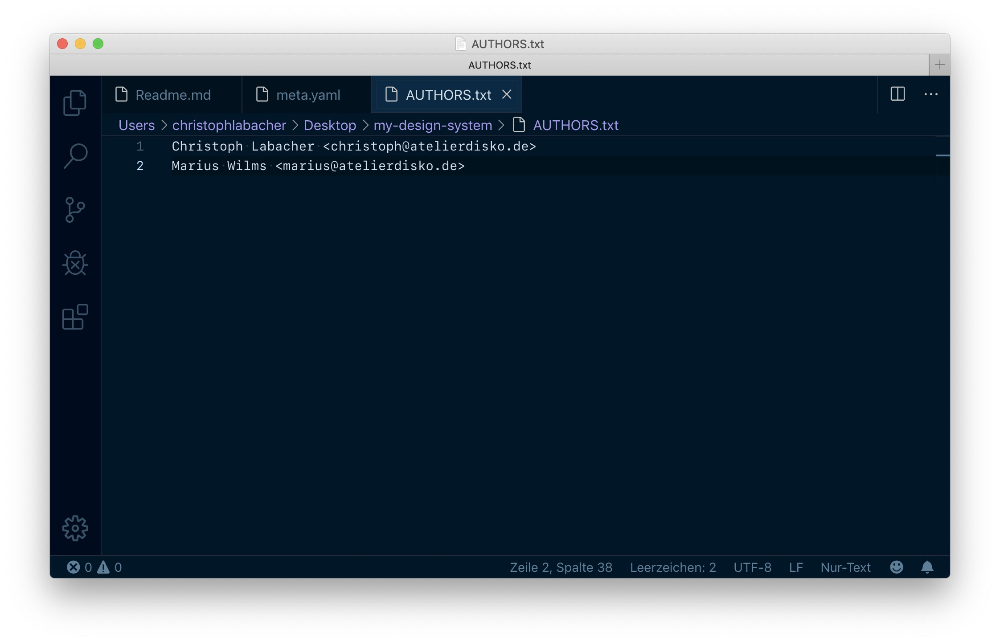

We need a `.txt`-file for that. Go to your programs folder and search for “TextEdit”. Create a new file and paste all authors and their email addresses as follows:

```
Christoph Labacher <christoph@atelierdisko.de>
Marius Wilms <marius@atelierdisko.de>
```

Click the “Format” menu and select “Make Plain Text”.  Save the file and name it “AUTHORS.txt” (the file has to be called exactly that). Place it in the root of your design definitions tree (the “my-design-system” folder).

If you now refresh the page for the aspect that you added the meta data to you will see that instead of the authors email address, their name is displayed. When you click on it, a window to compose an email addressed to this person opens.

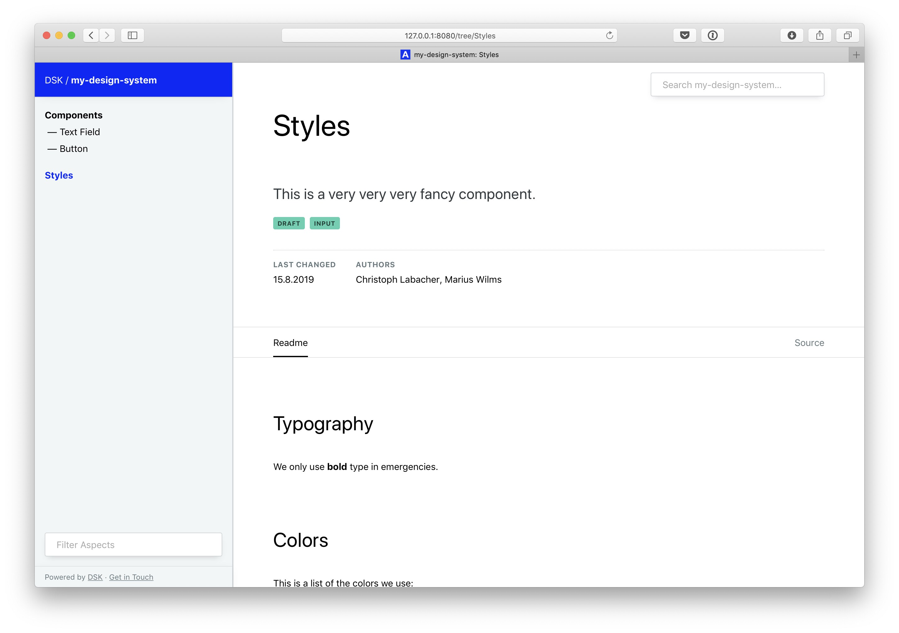

## 💙 — Step 12: Good to go! 
**This completes the step-by-step guide to DSK** – you used all its basic features and can now get started with documenting your Design Systems! On this website you find a detailed documentation of all features and some more advanced tricks, like more information about [using Markdown](/The-Design-Definitions-Tree/Documents) (including how to use images and videos in your documents), about using [special components](/The-Frontend/Documentation-Components) to improve your documentation, or ways to [configure the frontend](/The-Frontend/Configuration). If there are any questions left, feel free to reach out and [we are happy to help you get started](/Help).
