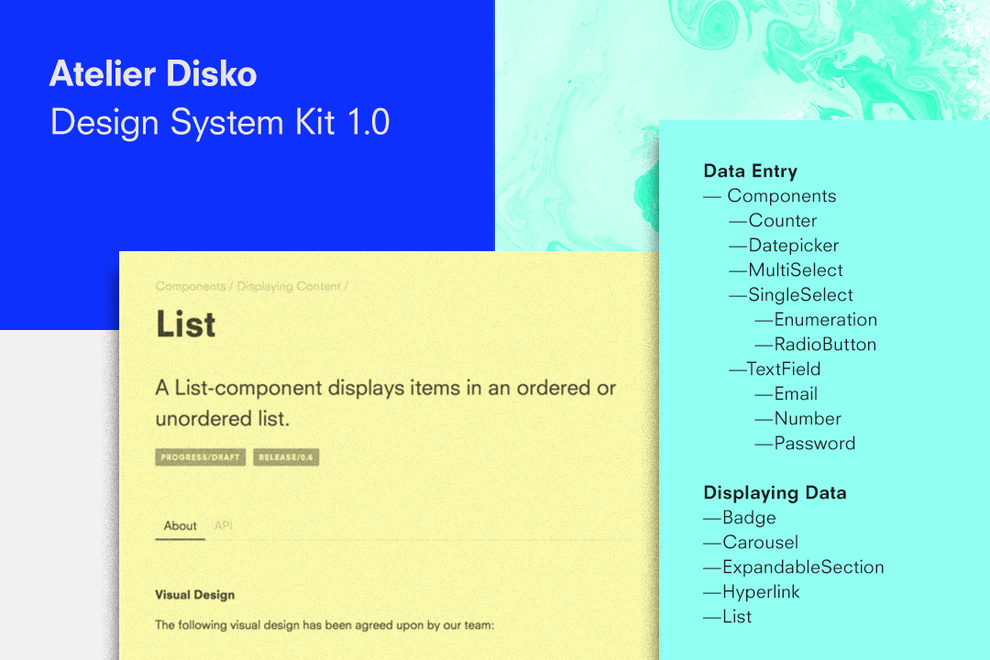
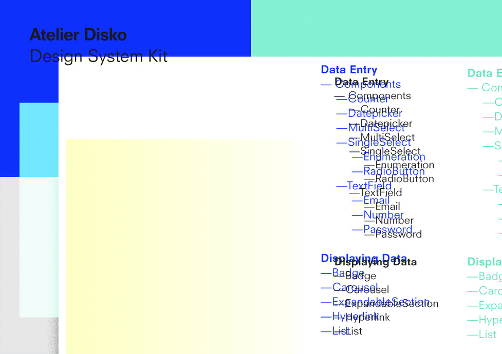
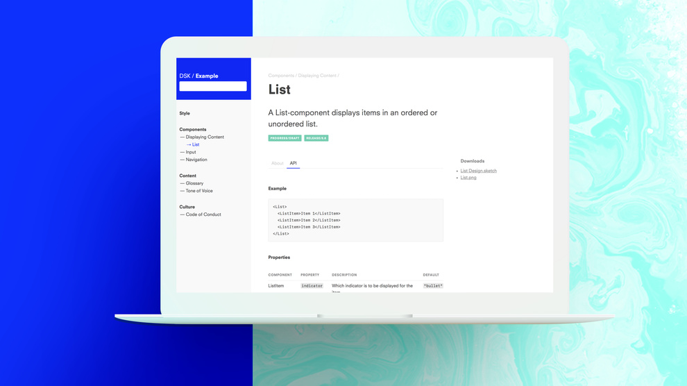

## What are Design Systems?

  

As digital products have grown bigger and more complex, so has the effort required to design them. Large teams managing multiple products simultaneously have brought to light organizational challenges that need to be addressed to be able to attain and maintain high quality product design. 

**Many teams have found one answer to these demands in Design Systems**: repositories of organizational knowledge on design that go beyond mere styleguides by incorporating both very abstract design principles and very concrete elements in the form of strictly defined UI components. Design Systems enable teams to speak one shared language and access a set of common components that they can use across products. This allows for greater consistency but also helps making sure that rather than having different people spend time trying to solve the same problem over and over, solutions get shared and new problems can be addressed.

Well known examples of Design Systems that have been made public include [IBM’s “Carbon Design System”](http://carbondesignsystem.com), [Atlassian’s design language](https://atlassian.design) and [Shopify’s “Polaris”](https://polaris.shopify.com).

## Where do you Build a Design System?

When confronted with the task to create a Design System from scratch for a client we found ourselves pondering this very question. After interviewing several people in the organization about their needs and surveying the client’s existing products we had a rough idea about what the Design System needed to include and wanted to get started. We noticed two things: First, a Design System is a complex system of interconnected elements – we needed a way to express this structure accordingly in order to do it justice. Second, we needed to get started quickly to make sure everyone on the team was on the same page, creating a language for ourselves. The ability to roughly sketch out thoughts in one place and come back to refine later, while expressing very detailed ideas in other places was vital to us.

**Unable to find a tool that satisfied these demands in a way suitable for the task, we created DSK as a workbench for collaboratively creating Design Systems.**

## DSK: Core Concepts

### Trees

It is important to find a balance between the complexity of a Design System and a structure that is understandable and manageable for humans. Especially in the beginning, when much is still in flux it is helpful to have a clearly defined, if overly complex structure, that can later be simplified for everyday use. 

Most Design Systems are organized in a tree like structure, as this allows for high complexity via deep nesting and cross links, while maintaining great accessibility. DSK is built on this idea.

### Diverse Forms of Expression

A Design System is home to a diverse set of contents – this is even more true during the phase of its initial creation: Components are made up of written descriptions and tables, notes, screenshots of what they looked like before, [Sketch](https://www.sketchapp.com/) files of what they might look like soon, JavaScript prototypes of how they might work, [React](https://reactjs.org/) components of how they could be implemented and so on. Maybe throw in a color library and some font files? DSK allows for any kind of content to be added to the Design System.  

### Direct Manipulation

To ensure a high velocity of change and the ability to quickly react to new developments, another core concept of DSK is direct manipulation: Changing content, moving components around and renaming parts of the tree have to happen instantly.

## The Design Definition Tree

  

The solution to these three requirements lies closer than one might figure: We found them solved in the file system. The file system therefore became the basis for DSK – it is were the “design definition tree” is kept and manipulated. This tree can be nested as you see fit, each folder can contain more folders and any number of files. In the end, each component is represented by one folder.

## Getting it out There

DSK takes this tree and represents it as a navigable and searchable webpage. It pulls meta-information from a special file that contains information on the author of the component, its version and most importantly keywords that can be used to filter the Design System. Any [Markdown](https://guides.github.com/features/mastering-markdown/) files contained in a folder are represented directly on the page, while any other filetypes are displayed as download links. Changes to the file system are immediately mirrored in DSK.

When run locally, the DSK executable looks for the design definitions tree in the folder that it is located in. Starting DSK is as easy as double clicking the file to run it and opening the browser.

  

### Deployment via Dropbox

In order to get started immediately, we used an unusual place to host our Design System during the first weeks of development: The design definition tree was placed in a Dropbox folder – making sure everybody was always using the same version. Each team member ran DSK locally, while using a shared folder to stay in sync.

This also meant we could deploy new versions of DSK immediately and without anyone actively updating, simply be replacing the executable in Dropbox. This proved to be a highly advantageous mode of work, allowing us to move blazingly fast and add new features as we noticed the need for them.

### Version Control via Git

Another way of using DSK that is enabled by using the file system as a base is taking advantage of Git for version control. Once our Design System had stabilized and the basic structure had been carved out, we changed to a more formal way of collaborating on it by moving it to a Git repository. Using commits and pull request we started versioning the Design System and provided pre-release version of it to some people in the organization. These first testers still ran DSK locally, but were using it purely to navigate the Design System rather than edit it.

### DSK as an API

When we started building DSK we were looking for a tool to help us create the Design System, to provide us with a place to express our ideas. It was not meant to be the final place for the Design System to be used by the whole organization. But when working with our first testers we noticed that so much was already working great that building a completely new way to present the Design System would be foolish. Instead we created a hosted version of DSK and started using it as an API to provide us with the design definitions tree. We then built a custom, styled front-end for the client, presenting the Design System in a branded way with custom-fit components. This hosted version is accessibly by the client anytime and can be used by anyone in the organization.  

## General Availability

DSK is [open source software](https://opensource.org/osd) and available under the permissive BSD License which allows you to download, use and modify the software freely. 

With today’s release we want to emphasize the production readiness of DSK. [The quickstart guide](https://github.com/rundsk/dsk#quickstart) over on our project page on [GitHub](https://github.com/rundsk/dsk) walks you through the process of setting up DSK in four simple steps. 

We’d like to take this special chance and thank all contributors who have been involved in architecting, designing, building, testing, proof reading, peer reviewing and refining the Design System Kit for this release. **At Atelier Disko we design and build great software together.**  

[Visit the Design System Kit Project Page](https://github.com/rundsk/dsk)

In case you find a bug, we’re glad to hear about it in our [issue tracker](https://github.com/rundsk/dsk/issues). If you’d like to contribute to the future development of DSK as a designer or developer or have questions, we’ll be answering your email under mariuswilms@mailbox.org and christoph@atelierdisko.de.
