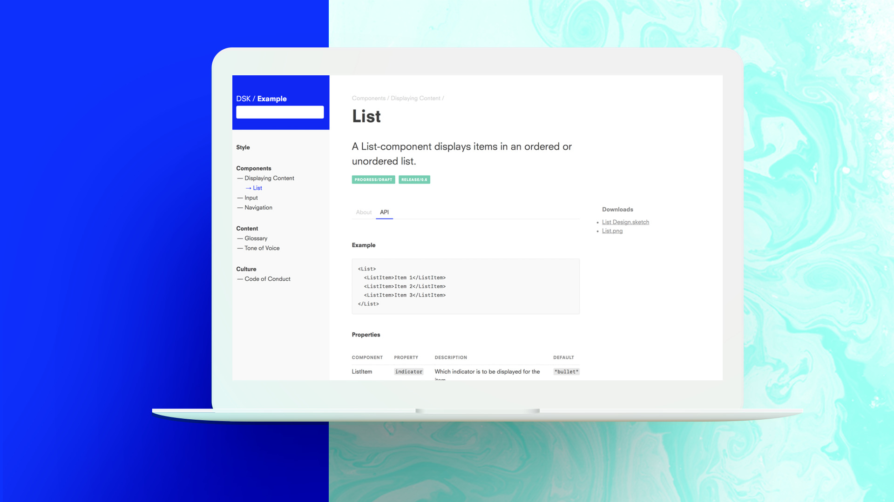
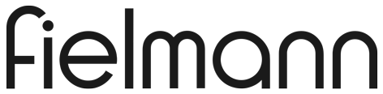

# Design System Kit

Using the Design System Kit you quickly define and organize
_design aspects_ into a browsable and live-searchable design system.
Hierarchies between design aspects are established using plain
simple directories. Creating documentation is as easy as adding a
[Markdown](https://guides.github.com/features/mastering-markdown/) formatted
file to a folder inside the _design definitions tree_.

Get started with our [Step by Step Guide](Getting-Started/Step-by-Step) 
or [download the latest DSK release](https://github.com/rundsk/dsk/releases/latest).

## Business Solution Partners

Don’t worry, you can use DSK on your own, but if you would like some help with
creating a Design System for your organization or running DSK, contact one of
our official business solutions partners.

<a href="https://atelierdisko.de">Atelier Disko</a> is a German design and
software studio, developing future oriented solutions for humans and businesses
alike. Atelier Disko provides services around creating and maintaining
top-of-the-industry design systems backed by DSK.

## Sponsors

Development of DSK as an Open Source project would not be possible without our fine sponsors.

<a href="https://fielmann.com">Fielmann</a> is a German eye-wear company
and market leader in Germany. As our first sponsor, Fielmann has been
extremely supportive in building significant features, i.e. versioning
as well as taking an important role in the bootstrapping phase of DSK.

<a href="https://dpa.com">Deutsche Presse-Agentur</a> is the German
news agency founded in 1949. The agency is primarly sponsoring content
creation features, like individual documentation components, as
well as infrastructure related ones. DSK is used at dpa, to drive one of
its <a href="https://developerdocs.dpa-id.de">public documentation
platforms</a>.

